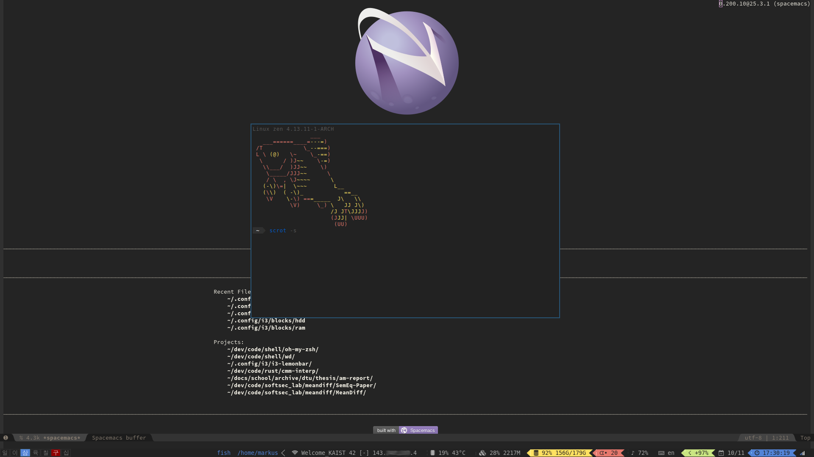

i3 and i3blocks
===============



Below I describe some of the tricks to my setup. The full configs are found in this directory.

## Workspaces
After some time living in Korea, I use Sino-Korean numbering for my workspaces.

```
# switch to workspace
bindsym $mod+1 workspace 1:일
...
bindsym $mod+0 workspace 10:십

# move focused container to workspace
bindsym $mod+Shift+1 move container to workspace 1:일
...
bindsym $mod+Shift+0 move container to workspace 10:십

bar {
    ...
    strip_workspace_numbers yes
    ...
}
```

## i3-gaps
I use a patched version of i3, called
[i3-gaps](https://github.com/Airblader/i3), which has some nice features like
settings the height of the bar, smart boarders and gaps.

```
# hide title
for_window [class="^.*"] border pixel 2
new_window pixel 2

# i3-gaps
smart_gaps on
smart_borders on

bar {
    ...
    height 20
    ...
}
```

## i3bars


```
bar {
    status_command i3blocks -c ~/.config/i3/i3blocks.conf
    ...
}
``` 

### Icons
Most of the icons come from [FontAwesome](http://fontawesome.io/icons/), and
used with pango markup as explained in the [i3block
FAQ](https://github.com/vivien/i3blocks/wiki/FAQ#how-can-i-put-icons-in-my-blocks).
    
On Arch, the font can be installed through the `community/ttf-font-awesome` package.

### Powerline
I first tried [electro7's
setup](https://github.com/electro7/dotfiles/tree/master/.i3/lemonbar) using
lemonbar and conky, but much better liked i3blocks due to its simplicity.

I therefore hacked together some powerline stuff by printing powerline's glyphs
(``, ``, ``, ``) so the colors matched the next block. Essentially, I do
something like the following in each block:
```bash
# collect
local value="$(date '+%H:%M:%S')"

# colors
FG=$BLA # color of the surrounding block
BG=$BLU # color of the block

# draw
local prefix="<span font='FontAwesome'>\uf017</span> "
local before="<span color='${BG}' bgcolor='${BLA}'></span>"
local after="<span color='${BLA}' bgcolor='${BG}'></span>"

local text="<span color='${FG}' bgcolor='${BG}'> ${prefix}${value} </span>"

# echo pango
echo -e "${before}${text}${after}"
```
See the full thing in the `blocks/` subdir. Here, the `block/wrap` script
includes the other scripts with some colors and setup code.

This requires installing and setting some [powerline patched
font](https://github.com/powerline/fonts) with pango:
```
bar {
    ...
    font pango:DejaVu Sans Mono for Powerline 10
    ...
}
``` 
